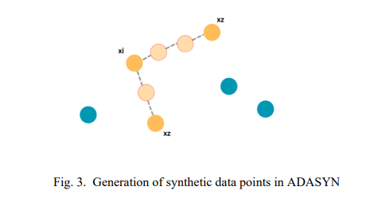
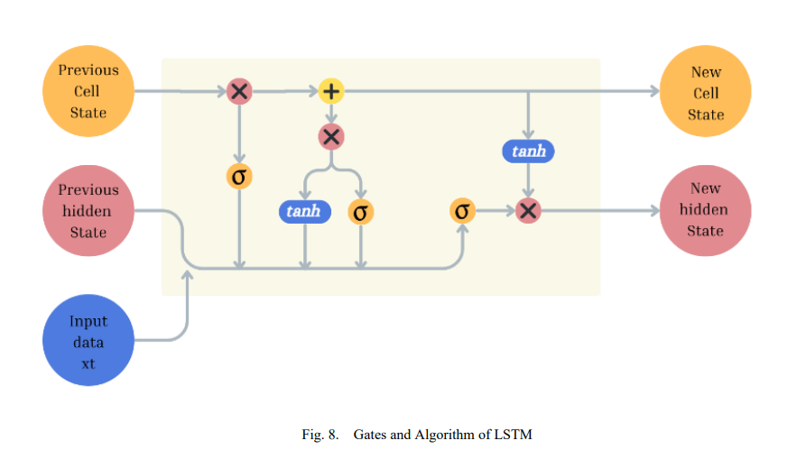
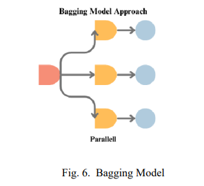
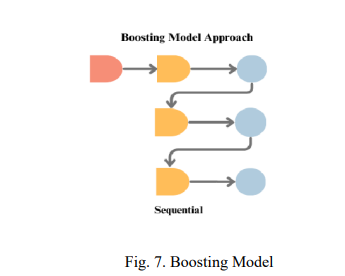
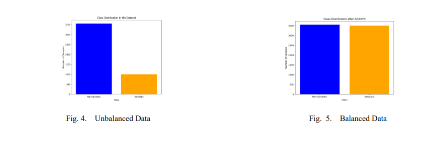
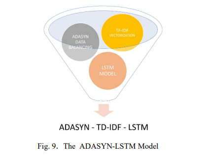

# Model-Comparison-Sarcasm-Detection
The two main types of sarcasm detection are:

A. **Sentiment-based Sarcasm Detection:** This approach focuses on analyzing a text's sentiment or emotional tone to detect sarcasm and is often called "Sentiment-based Sarcasm Detection." It looks for variances between the expressed sentiment and the text's meaning. For example, if a statement appears positive in sentiment but is meant sarcastically, the model would identify it as sarcasm.

B. **Pattern-based Sarcasm Detection:** Pattern-based detection depends on recognizing particular language cues, patterns, or features commonly associated with sarcasm. This approach doesn't necessarily focus on sentiment while searching for distinctive word combinations, negation, or incongruity between words and context to flag potential sarcasm.

**Types of Sarcasm Detection**

**Sentiment-Based Detection:** Visualize sentiment analysis icons (positive, negative, neutral) with arrows pointing to a sarcastic comment.Pattern-Based Detection: Show linguistic patterns (question marks, negations, irony symbols) leading to identification of sarcasm.

**Impact of Sarcasm**

**Emotional Impact**: Visualize emoticons or facial expressions showing confusion or misunderstanding caused by sarcasm.Communication Breakdown: Arrows depicting misinterpretation or confusion in communication due to sarcasm.Challenges in Sarcasm Detection

**Challenges in Sarcasm Detection**

**Ambiguity:** Illustrate ambiguous statements with dual-meaning arrows (literal vs. intended meaning).Cultural Variations: Flags or globe icons showing different cultural contexts impacting sarcasm interpretation.Ethical Considerations

**Bias and Fairness:** Scales or balance icons representing fairness in sarcasm detection across different demographics.

**Privacy:** Lock icons or silhouettes representing privacy concerns in analyzing sarcastic social media posts.

This project focuses on comparison between different AI-models that can be used to detect the twitter sarcastic text..We have compared all the models including ADASYN,LSTM and Bagging Random Forest.

**Model Selection**

1. **ADASYN (Adaptive Synthetic Sampling):**
   - **Description:** ADASYN is an oversampling technique used to balance imbalanced datasets. In the context of sarcasm detection, it might be applied to address the class imbalance issue if sarcastic and non-sarcastic tweets are not evenly distributed.
   - **Application:** ADASYN can be used to generate synthetic examples of the minority class (sarcastic tweets) to improve the model's ability to detect sarcasm in an imbalanced dataset.

2. **LSTM (Long Short-Term Memory):** Long Short Term Memory (LSTM) model is a neural network architecture. Renowned for its sequence-to-sequence capabilities and contextual understanding, LSTM incorporates a Transformer layer to grasp the nuances of language patterns. This model excels in capturing long-range dependencies within textual data, vital in the context of sarcasm detection. With its attention mechanisms and memory retention, Transformer LSTM promises to unearth the subtle linguistic cues that underpin sarcastic expressions within the Twitter dataset.
3. 

3.**Bagging Model- Ensemble Random Forest :** Bagging, embodied by the Random Forest model, thrives on the principle ofensemble learning. It assembles an array of decision tree classifiers, each trained on a random subset of the dataset.Combining the predictions of these diverse trees, it creates a resilient ensemble model. Random Forest excels in capturing complex relationships within data, making it a suitable candidate for the intricate task of sarcasm detection. Its ensemble nature mitigates overfitting and enhances robustness, demonstrating a holistic understanding of language nuances.

4.**Boosting Model:** XGBoost, a quintessential boosting algorithm, amplifies the predictive prowess of weak learners into a formidable model. By sequentially training a series of decision trees, it emphasizes the misclassified data points from preceding trees, progressively refining its predictive accuracy. XGBoost's adaptability and ability to handle complex, non-linear relationships are assets that shine in the intricate landscape of sarcasm detection. Its capability to handle imbalanced datasets, coupled with a commitment to precision, renders it a potent tool in our analytical arsenal.

**Elaboration of Comparison:**

1. **Dataset Description :**
   - Twitter, as a prolific source of real-time, user-generated content, stands as an invaluable resource for showcasing the real-world impact of sarcasm detection models. In the era of digital communication, Twitter stands as a lively representation of a diverse range of feelings, perspectives, and interactions. Its concise format and instant nature symbolize the rapid dissemination of information., making it an impactful platform to illustrate the real-world implications of accurate sarcasm detection. By analyzing Twitter data, this study not only pushes the boundaries of natural language processing but also highlights its importance in maneuvering the complexities of contemporary digital discussions.. For this research, we utilized a Kaggle dataset, which featured 4,500 entries, including 3,500 non-sarcastic and 1,000 sarcastic expressions. The dataset's source, Kaggle, is celebrated for its repository of diverse datasets and data-driven challenges. The data consists of integral labels, 0(non-sarcastic) and 1(sarcastic).
   - 
2. **Handling Imbalanced Data:**
   - In the quest for diverse and comprehensive data., we've utilized the Adaptive Synthetic Sampling (ADASYN) technique. This resampling approach, a vital element of data preparation, serves as a key factor in addressing the issue of class imbalance. In this research, we observed a noticeable class imbalance, with a significant majority of non-sarcastic expressions compared to the fewer instances of sarcastic ones. ADASYN is specifically designed to dynamically generate synthetic data points within
the minority class to rectify this imbalance.

     

3. **Feature Representation:**
   -Feature extraction is a fundamental step in preparing textual data for machine learning. In this research, the textual content of Twitter expressions underwent Term Frequency-Inverse Document Frequency (TF-IDF) vectorization. TF-IDF is a widely used technique that quantifies the significance of words and phrases within text documents. In this context, the TF-IDF vectorizer was configured to consider a maximum of 5,000 features while excluding common English stop words and considering word combinations up to bi-grams (n-grams with a range of 1 to 2). This transformation rendered the textual data into a numerical format that could be processed by machine learning models. TF-IDF encapsulated the essence of the expressions, empowering subsequent analyses with rich and informative features extracted from the text.

4. **Training Time and Resource Requirements:**
   - Compare the computational resources and training times required for each model. LSTM, being a deep learning model, may demand more resources compared to ensemble methods like Bagging Random Forest.

5. **Model Performance:**
   - Evaluate the performance of each model in terms of accuracy, precision, recall, F1 score, and any other relevant metrics. Consider using cross-validation to obtain a robust estimate of the models' performance.

6. **Interpretability:**
   - Consider the interpretability of the models. Bagging Random Forest, being an ensemble of decision trees, might provide insights into feature importance, while LSTM's inner workings may be less interpretable.

7. **Scalability:**
   - Assess the scalability of the models, especially if you plan to deploy the sarcasm detection system on a larger scale. Consider factors such as ease of deployment and real-time processing.

Colab File:https://colab.research.google.com/drive/1Jnhfh0c6A9E9gr5cnXBlBnVWYs-cALb3?usp=sharing
