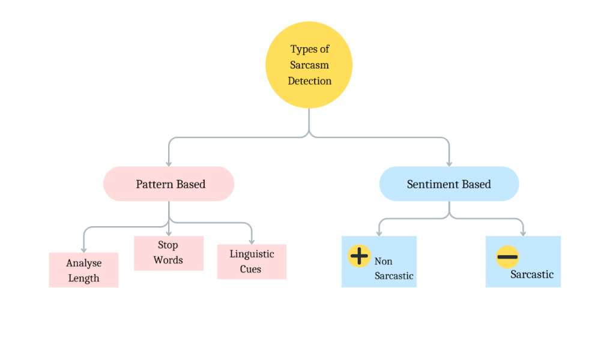
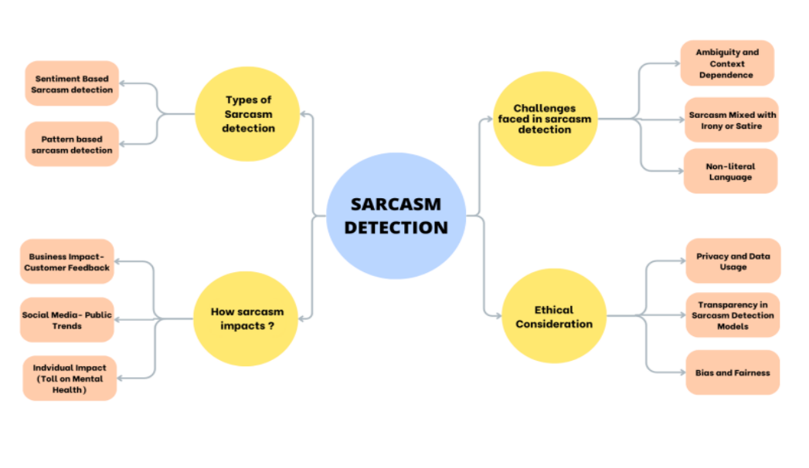

# Model-Comparison-Sarcasm-Detection
The two main types of sarcasm detection are:

A. **Sentiment-based Sarcasm Detection:** This approach focuses on analyzing a text's sentiment or emotional tone to detect sarcasm and is often called "Sentiment-based Sarcasm Detection." It looks for variances between the expressed sentiment and the text's meaning. For example, if a statement appears positive in sentiment but is meant sarcastically, the model would identify it as sarcasm.

B. **Pattern-based Sarcasm Detection:** Pattern-based detection depends on recognizing particular language cues, patterns, or features commonly associated with sarcasm. This approach doesn't necessarily focus on sentiment while searching for distinctive word combinations, negation, or incongruity between words and context to flag potential sarcasm.

**Types of Sarcasm Detection**

**Sentiment-Based Detection:** Visualize sentiment analysis icons (positive, negative, neutral) with arrows pointing to a sarcastic comment.Pattern-Based Detection: Show linguistic patterns (question marks, negations, irony symbols) leading to identification of sarcasm.

**Impact of Sarcasm**

**Emotional Impact**: Visualize emoticons or facial expressions showing confusion or misunderstanding caused by sarcasm.Communication Breakdown: Arrows depicting misinterpretation or confusion in communication due to sarcasm.Challenges in Sarcasm Detection

**Challenges in Sarcasm Detection**

**Ambiguity:** Illustrate ambiguous statements with dual-meaning arrows (literal vs. intended meaning).Cultural Variations: Flags or globe icons showing different cultural contexts impacting sarcasm interpretation.Ethical Considerations

**Bias and Fairness:** Scales or balance icons representing fairness in sarcasm detection across different demographics.

**Privacy:** Lock icons or silhouettes representing privacy concerns in analyzing sarcastic social media posts.

This project focuses on comparison between different AI-models that can be used to detect the twitter sarcastic text..We have compared all the models including ADASYN,LSTM and Bagging Random Forest.

1. **ADASYN (Adaptive Synthetic Sampling):**
   - **Description:** ADASYN is an oversampling technique used to balance imbalanced datasets. In the context of sarcasm detection, it might be applied to address the class imbalance issue if sarcastic and non-sarcastic tweets are not evenly distributed.
   - **Application:** ADASYN can be used to generate synthetic examples of the minority class (sarcastic tweets) to improve the model's ability to detect sarcasm in an imbalanced dataset.

2. **LSTM (Long Short-Term Memory):**
   - **Description:** LSTM is a type of recurrent neural network (RNN) that is well-suited for sequence modeling. It can capture long-range dependencies in data, making it effective for analyzing the sequential nature of text, such as tweets.
   - **Application:** LSTM can be trained on sequences of words in tweets to learn contextual information and identify patterns associated with sarcasm.

3. **Bagging Random Forest:**
   - **Description:** Random Forest is an ensemble learning method that combines multiple decision trees to make predictions. Bagging (Bootstrap Aggregating) is a technique where multiple models are trained on different subsets of the training data.
   - **Application:** In the context of sarcasm detection, a Bagging Random Forest can be applied by training multiple decision trees on different subsets of sarcastic and non-sarcastic tweets, and then aggregating their predictions.

**Elaboration of Comparison:**

1. **Data Preprocessing:**
   - Consider how each model handles preprocessing tasks such as tokenization, stemming, or lemmatization to prepare the text data for analysis.

2. **Handling Imbalanced Data:**
   - Analyze how each model deals with the imbalanced nature of sarcasm detection on Twitter. ADASYN explicitly addresses this issue by oversampling the minority class, while LSTM and Bagging Random Forest might require additional techniques or modifications to handle imbalanced datasets.

3. **Feature Representation:**
   - Explore how each model represents features from the text data. LSTM naturally captures sequential dependencies, while Bagging Random Forest may rely on bag-of-words or other text representation techniques.

4. **Training Time and Resource Requirements:**
   - Compare the computational resources and training times required for each model. LSTM, being a deep learning model, may demand more resources compared to ensemble methods like Bagging Random Forest.

5. **Model Performance:**
   - Evaluate the performance of each model in terms of accuracy, precision, recall, F1 score, and any other relevant metrics. Consider using cross-validation to obtain a robust estimate of the models' performance.

6. **Interpretability:**
   - Consider the interpretability of the models. Bagging Random Forest, being an ensemble of decision trees, might provide insights into feature importance, while LSTM's inner workings may be less interpretable.

7. **Scalability:**
   - Assess the scalability of the models, especially if you plan to deploy the sarcasm detection system on a larger scale. Consider factors such as ease of deployment and real-time processing.

Colab File:https://colab.research.google.com/drive/1Jnhfh0c6A9E9gr5cnXBlBnVWYs-cALb3?usp=sharing
